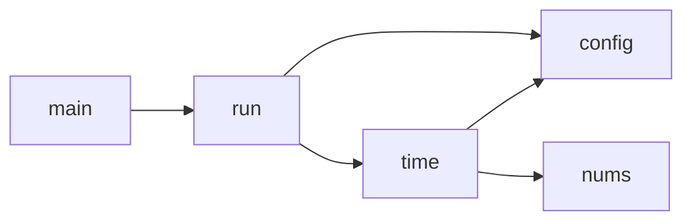

# Review of the TypeScript implementation

[Era][era] is TUI rainy clock written in TypeScript.

[era]: https://github.com/kyoheiu/era

In this file, we will inspect how it is implemented.

## Module structure

| Module      | Overview               |
| ----------- | ---------------------- |
| `main.ts`   | Entrypoint, parse args |
| `run.ts`    | The run loop           |
| `config.ts` | Config file IO         |
| `nums.ts`   | The digit "font"       |
| `time.ts`   | How time and rain      |



## Logic

Two mode:

```ts
enum Kind {
  Clock,
  Counter,
}
```

How render works:

- Redraw each frame using `draw` closure
  - `timer_point` calculate timer coordinate
  - `call_rain` update the rain position
    - new drops appear randomly on top
    - old drops fall down one cell
    - `make_drop` create new rain drops
  - iterate x y to render
    - if rows in time region, draw time
    - otherwise draw rain
- setInterval to draw frames
